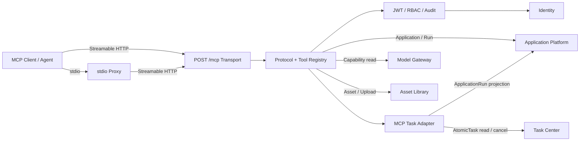
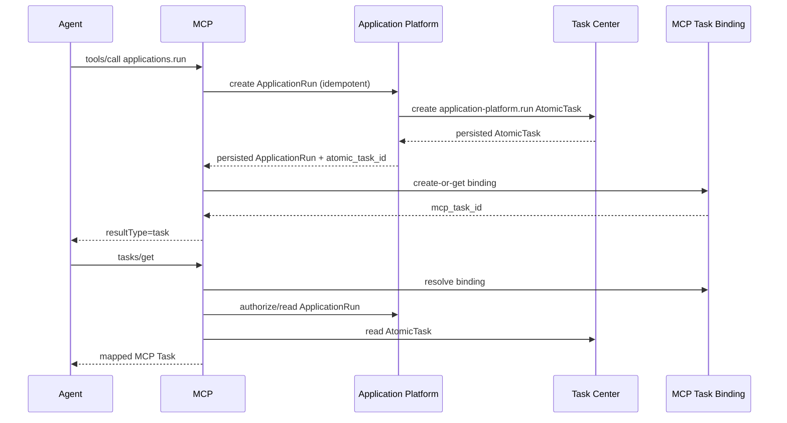

# MCP 领域架构参考

本文件说明 MCP `2026-07-28` 访问层的运行关系。产品语义以 `00_product/domains/mcp/product-spec.md` 为准，实现合同以 `01_contracts/domains/mcp/` 为准。

## 1. 组件关系

## 2. ApplicationRun 与 MCP Task

返回 Task 前的三个持久化边界严格有序：ApplicationRun、AtomicTask、McpTaskBinding。Binding 失败不回滚已创建的源领域资源，客户端降级获得 `application_run_id`；不得返回无绑定 Task ID。

## 3. 数据和安全边界

- MCP 数据库只保存短期 Task Binding，不复制业务状态或媒体。
- 所有请求使用 Identity JWT；stdio 进程环境只提供凭证，不形成连接级 Principal。
- Tool/Resource 调用同时校验 MCP 权限和目标领域权限。
- JSON-RPC 不传大型二进制；上传内容直接进入 Asset API 受控端点。
- Tool、Resource 和 Task 结果只包含一跳权限裁剪投影。
- MCP 不订阅业务事件；每次查询读取当前源领域事实。

## 4. 部署与故障

- MCP Transport 可以随 `omnimam-server` 部署，不要求独立服务。
- 多实例共享 McpTaskBinding 存储；binding 创建依赖唯一约束保证幂等。
- Identity、Application Platform、Task Center 或 Asset Library 不可用时返回可重试 Tool Error，不创建替代事实。
- Binding TTL 清理由 MCP 自身执行，清理失败只增加短期存储占用，不影响业务运行。
- Audit 边界不可用时写操作 fail closed；只读操作按受控安全策略降级并记录指标。

## 5. 非目标

- 连接 Session、WebSocket、legacy initialize。
- CapabilityInvocation、Provider/Engine 管理和模型路由。
- 独立任务队列、任务状态机和业务事件。
- OAuth/PAT、Prompts、Apps、Sampling、`tasks/update`。
- 直接 StorageBackend 上传和媒体代理存储。
