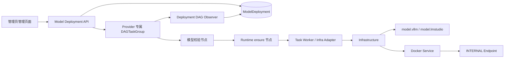
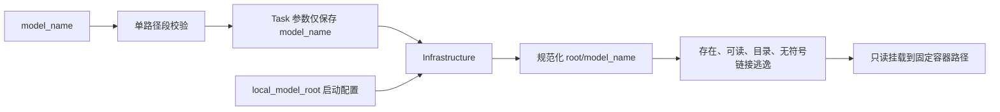

# Model Deployment Architecture

## 1. 组件关系

## 2. 模型路径

模型目录由 Infrastructure 根据 `local_model_root` 与 `model_name` 生成，并交给对应 Provider 的 RuntimeProfile 使用。

## 3. 生命周期

- vLLM DEPLOY/START 使用 `vllm.model.validate -> vllm.runtime.ensure`，RESTART 前置 `vllm.runtime.stop`。
- LM Studio 使用完全独立的同构 DAG 和 `lmstudio.*` functionRef，不与 vLLM 共享 Provider handler、Profile 或验证器。
- STOP/DELETE 使用各自 Provider 的 `runtime.stop` AtomicTask。
- Runtime 与 Endpoint 归 Infrastructure；DAGTaskGroup、AtomicTask 与 Attempt 归 Task Center；部署状态和当前引用归 Model Deployment。
- Model Gateway 不参与当前部署管理链路。
