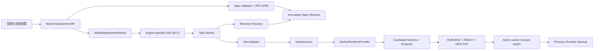
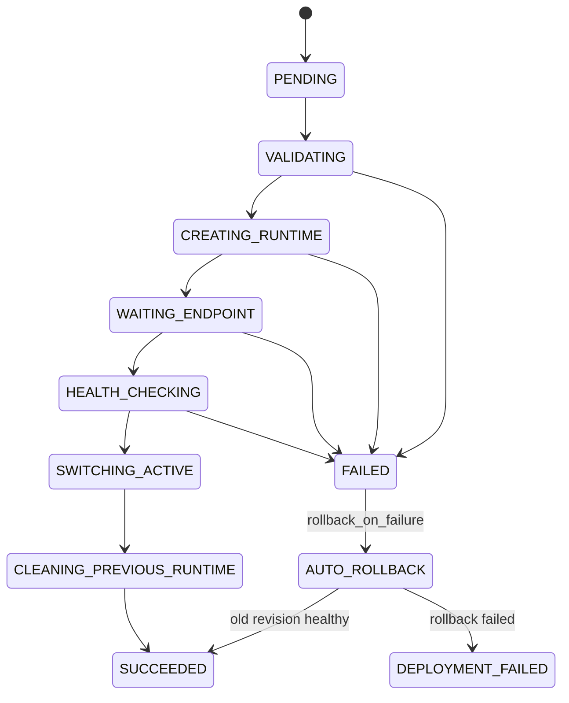
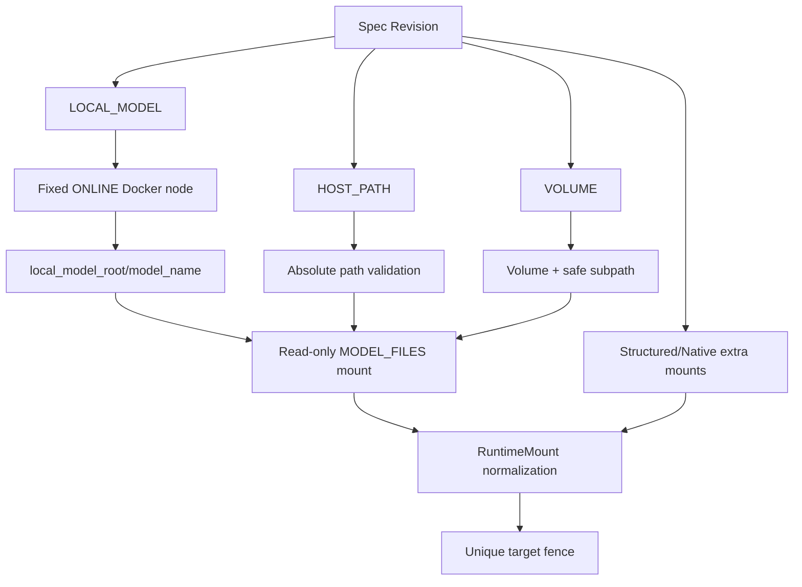

# Model Deployment Architecture

## 1. 配置与执行链路

`ModelDeploymentSpecRevision` 是期望配置唯一事实源。Task 只固定 Deployment、Rollout、Revision、digest、既有 Runtime、授权和资源版本；完整配置只在 Worker 当前 Attempt 内通过 resolver 读取。Infrastructure 根据 `runtime_provider=docker` 选择 DockerRuntimeSpec，并保存最终 Provider Spec/digest 与完整运行身份。

## 2. Revision 与 Rollout

INITIAL、APPLY、MANUAL_ROLLBACK、START、RESTART 和 AUTO_ROLLBACK 都是一等 Rollout。Apply 较早 Revision 创建 MANUAL_ROLLBACK；Apply active Revision 被拒绝。候选 Runtime 通过三重门禁后才切换 active Revision。Stop/Delete 使用独立 AtomicTask，与 current Rollout 互斥。

## 3. 模型来源与挂载

完整路径和环境变量只存在于受权 Revision 详情、Model Deployment 私有存储及当前 Provider 调用内存；列表、Rollout、Task、事件和普通日志不返回这些内容。

## 4. 未来 Kubernetes 映射

业务 Spec Revision 与 Kubernetes 对象/rollout 是一对多到多的映射。`resourceVersion`、`generation/observedGeneration` 和 Deployment rollout revision 归 Infrastructure Provider 观测；它们不能成为业务配置版本。业务回滚始终重新 Apply 完整 Spec Revision，Provider 对象清理不删除 Revision/Rollout 历史。

## 5. 事实归属

- Model Deployment：Deployment、Spec Revision、Rollout、active/pending 选择和生命周期投影。
- Task Center：DAGTaskGroup、AtomicTask、Attempt、`2.0` 合同和执行恢复。
- Infrastructure：InfraRuntime、Docker Provider Spec/identity、RuntimeMount、Endpoint 和 Provider 观测。
- Model Gateway：不参与当前部署管理链路。
