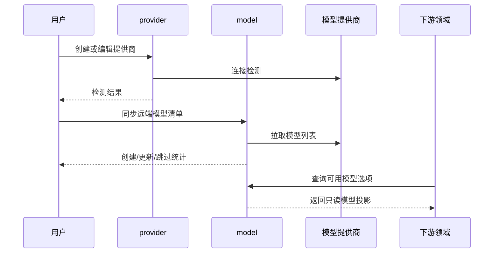

# 用户模型管理领域架构参考

## 1. 事实源

- S1：`00_product/domains/model-management/product-spec.md`
- S2：`01_contracts/domains/model-management/`

本文档描述模型管理领域的架构参考，不替代 S1/S2。

## 2. 模块划分

| 模块 | 架构职责 | 主要资源 |
| --- | --- | --- |
| `provider` | 管理当前用户的模型提供商、连接配置和连接检测 | `user_model_providers`、`model_health_checks` |
| `model` | 管理提供商下的模型清单、同步结果、健康状态和启用状态 | `user_provider_models`、`model_health_checks` |
| `default-model` | 管理不同用途的默认模型选择 | `user_default_model_configs` |
| `option` | 向下游领域提供当前用户可用模型只读选项 | 只读聚合 |

## 3. 外部依赖与被依赖

- 依赖 `identity` 提供当前用户身份、资源归属和权限边界。
- 被 `ai-chatting` 依赖，用于助手建议模型、聊天默认模型、翻译模型和模型健康判断。
- 后续应用运行或任务执行需要模型能力时，应优先通过只读模型选项获取，不直接读取或复制模型提供商密钥。

## 4. 核心链路

## 5. 状态与一致性

- 模型健康状态使用 `unknown`、`healthy`、`unhealthy`。
- 提供商删除、模型删除和默认模型配置之间必须保持引用一致性；默认模型不能指向不可用或不可见模型。
- 连接检测和模型检测写入检测记录，但不应替代模型配置本身。
- 同步远端模型清单应以逐项结果表达创建、更新和跳过，不应只返回整体成功。

## 6. API 面

S2 OpenAPI 将能力拆为：

- `/api/v1/model-providers`
- `/api/v1/model-providers/test`
- `/api/v1/model-providers/{provider_id}/test`
- `/api/v1/model-providers/{provider_id}/models`
- `/api/v1/model-providers/{provider_id}/models/sync`
- `/api/v1/provider-models/{model_id}`
- `/api/v1/provider-models/{model_id}/test`
- `/api/v1/default-models/{usage}`
- `/api/v1/model-options`

## 7. 架构风险

- 下游领域不得持久化模型密钥或提供商完整配置。
- 模型健康检测可能较慢，应避免阻塞列表查询和默认模型读取。
- `usage` 当前限定为 `assistant.default`、`quick`、`translation`；新增用途需要先更新 S1/S2。
