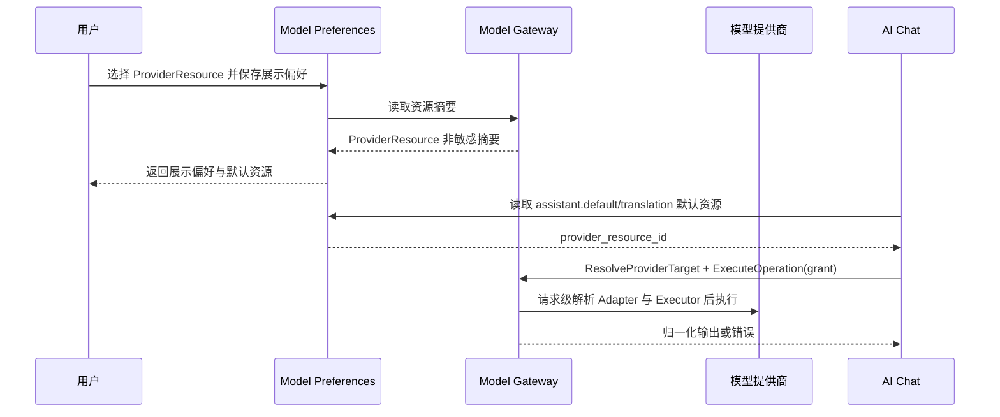

# Model Preferences 领域架构参考

## 1. 事实源

- S1：`00_product/domains/model-preferences/product-spec.md`
- S2：`01_contracts/domains/model-preferences/`

本文档描述 Model Preferences 与 Model Gateway 的协作架构，不替代 S1/S2。

## 2. 模块划分

| 模块 | 架构职责 | 主要资源 |
| --- | --- | --- |
| `provider-type` | 读取 Gateway 提供的稳定 Provider Type 目录，不暴露 Adapter/Executor ID | 只读聚合 |
| `model-preference` | 管理 ProviderResource 的显示覆盖和分组 | `model_preferences` |
| `default-model` | 管理不同用途的默认 ProviderResource 引用 | `default_model_preferences` |
| `option` | 向下游领域提供当前用户可用模型只读选项 | 只读聚合 |
| `execution-context` | 不属于本领域；Gateway 负责目标校验和 Grant 签发 | `provider-execution-grant://` |

## 3. 外部依赖与被依赖

- 依赖 `identity` 提供当前用户身份、资源归属和权限边界。
- 依赖 `modelgateway` 提供 ProviderResource 目录的受控摘要。
- 被 `ai-chatting`、`agent` 依赖，用于助手建议、用途默认资源解析；执行资格由 Gateway 最终校验。
- 本领域不维护 Provider 专用 HTTP 客户端、健康、能力或凭证事实。

## 4. 核心链路

## 5. 状态与一致性

- 偏好只保存 ProviderResource ID、显示覆盖、分组和用途默认引用，不缓存 enabled、health、capability 或 endpoint。
- 默认引用指向不可见或已删除资源时保留引用但返回不可用摘要，由 Gateway 在执行前拒绝。
- `feature_labels` 仅用于展示和筛选，不参与执行能力判断。

## 6. API 面

S2 OpenAPI 将能力拆为：

- `/api/v1/model-preferences/models`
- `/api/v1/model-preferences/models/{provider_resource_id}`
- `/api/v1/model-preferences/defaults/{usage}`
- `/api/v1/model-preferences/options`

旧 `/model-providers`、`/provider-models`、`/default-models` 和 `/model-options` 不保留别名、重定向或兼容路由。

## 7. 架构风险

- 下游领域不得持久化模型密钥或提供商完整配置。
- 模型健康检测可能较慢，应避免阻塞列表查询和默认模型读取。
- Provider Type 必须映射到已注册 Adapter；任何客户端提交的 `adapter_id` 或 Provider 地址都必须拒绝。
- Gateway 当前资源不可用时，Model Preferences 只返回受控摘要和修正入口，不暴露 Adapter、凭证或私有配置。
- `usage` 当前限定为 `assistant.default`、`quick`、`translation`；新增用途需要先更新 S1/S2。
