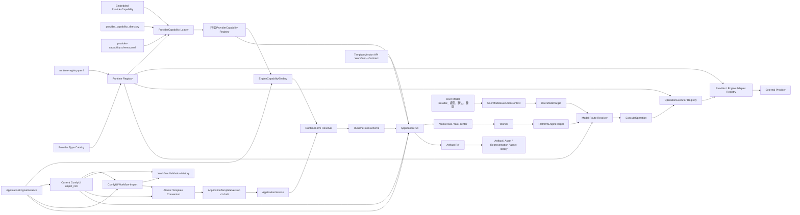
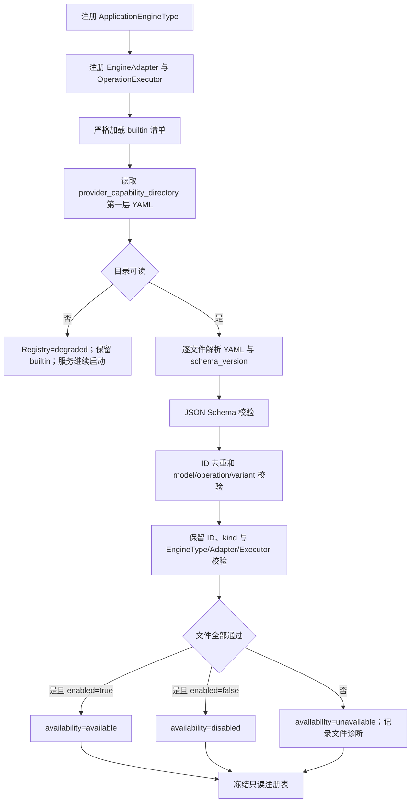
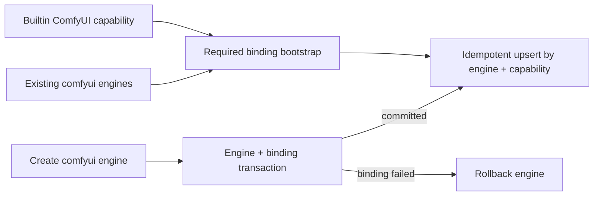
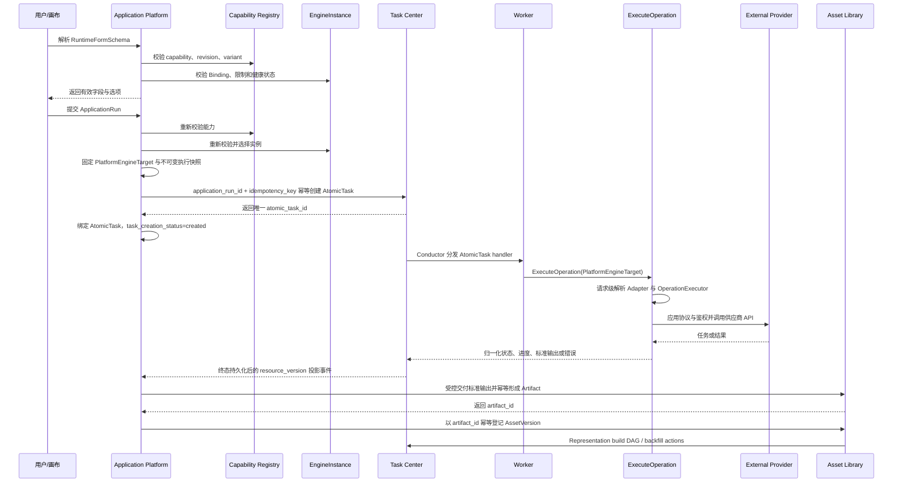
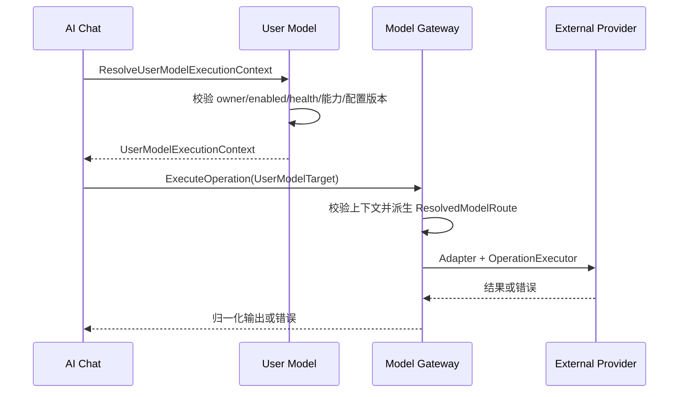

# Model Gateway 领域架构参考

本文在 application-platform v1.3.0 迁移的 Gateway 核心架构上补充 User Model 融合边界。产品语义以 `00_product/domains/modelgateway/product-spec.md` 为准，实现接口与数据结构以 `01_contracts/domains/modelgateway/` 为准。

Application Platform 保留 ApplicationExecutor、ApplicationRun 编排、运行快照和 Artifact 交付；User Model 保留用户 Provider、模型、默认配置、用户模型健康事实与资格校验；Model Gateway 提供 Registry、Engine、Binding、Adapter、发现、探测和统一 `ExecuteOperation` 边界。

## 1. 架构目标

- 将 ApplicationEngineType、EngineAdapter、OperationExecutor 与易变的平台能力清单分离。
- 通过 Runtime Registry 维护稳定 `provider_type -> adapter_id` 和 `capability -> operation_executor_id` 内部映射，客户端只选择 Provider Type。
- 统一支持 `PlatformEngineTarget` 与 `UserModelTarget`，并在请求内派生不持久化的 `ResolvedModelRoute`。
- 以内置 YAML 与启动目录 YAML 作为 ProviderCapability 事实源，不创建数据库副本。
- 内置清单严格校验并保留 ID；目录文件失败只导致能力级降级，不覆盖内置能力。
- ProviderCapability 与 ComfyUI workflow 使用联合能力来源；ComfyUI 节点能力只由 EngineInstance 当前 object_info 提供，不复制到工作流、校验、模板或运行。
- 将用户私有 ComfyUI 工作流的导入、解析、实例校验和可重复模板转换与 ApplicationTemplate 后续版本演进分离。

## 2. 模块关系



## 3. 启动注册顺序



加载按文件原子执行。内置清单无效时启动失败；目录文件名排序只保证诊断稳定，不赋予覆盖优先级。目录重复 ID 全部不可用，目录使用内置保留 ID 时只隔离目录项。运行中不监听目录；更新目录文件后必须重启。

## 4. ProviderCapability 边界

`kind=catalog` 的 ProviderCapability 描述：

- 平台、来源和人工核验日期；
- 模型 ID、供应商模型 ID、生命周期和限制；
- Operation 与 CapabilityDefinition 关系；
- Model × Operation 的有效 Variant；
- 输入输出 JSON Schema、必填项、枚举、范围和跨字段约束。

`kind=engine_binding` 只描述 EngineType 的基础运行时身份，其 model、operation、variant 固定为空。ProviderCapability 均不描述：

- 可执行代码或类名；
- API Key 等实例凭证；
- 管理员可写状态；
- 运行态 availability、失败原因、加载时间或来源文件路径；
- AtomicTask、Attempt、WorkflowRuntime 或重试策略事实。

`seedance.yaml` 使用 ByteDance Seed 定义模型能力、BytePlus ModelArk 定义可执行 API 参数；`deepseek.yaml` 只覆盖官方稳定 OpenAI-compatible Chat Completions；`comfyui.yaml` 是编译进服务的 required_immutable 绑定能力，不参与 Provider 模板或运行表单 Variant 解析。

### 4.1 三个正交维度

| 字段 | 取值 | 架构影响 |
| --- | --- | --- |
| kind | catalog / engine_binding | 决定是否存在模型目录以及是否允许进入 Provider 模板路径。 |
| origin | builtin / directory | 由加载器派生，决定失败策略与 ID 覆盖规则。 |
| binding_policy | manual / required_immutable | 决定绑定由管理员维护还是由启动 bootstrap 与实例创建事务维护。 |

ComfyUI 固定组合为 `engine_binding + builtin + required_immutable`。系统绑定只用于实例身份和管理投影；API Workflow、workflow contract 和当前 object_info 仍是 ComfyUI 模板与运行的能力事实。

### 4.2 系统绑定收敛



API Server 与 TaskWorker 都执行相同 bootstrap。唯一索引保证多副本只形成一条绑定；upsert 将 revision、enabled 和空 restrictions 恢复为当前内置事实。绑定管理 API 依据 ProviderCapability 的 binding_policy 派生 `system_managed` 并拒绝修改。EngineInstance 删除由外键 cascade 清理绑定。

## 5. Adapter、发现、探测与 OperationExecutor

Gateway Adapter 负责 Provider 或平台公共协议：

- base URL、鉴权和公共 Header；
- 网络、上传、模型发现、Provider/模型探测和平台级健康检测；
- 公共错误、追踪 ID 和状态映射。

OperationExecutor 负责具体 Operation：

- 标准输入与 ProviderCapability Variant 的双重校验；
- 供应商请求转换；
- 同步或异步提交、查询、取消和恢复；
- 输出提取、向 ApplicationExecutor 返回归一化输出和供应商错误。

YAML 和用户标签只能引用已注册的 Operation，不能补足缺失的执行器。Provider Type 是稳定公开类型，Adapter 与 Executor ID 只存在于内部 Registry。

`ExecuteOperation` 接受 `PlatformEngineTarget | UserModelTarget`、CapabilityDefinition、Operation 和标准参数。Gateway 校验目标类型、Registry 映射、principal、上下文签发者、能力、配置版本与有效期后，只在当前请求内产生 `ResolvedModelRoute`。Gateway 不为该结果建表、缓存第三份模型事实或提供 CRUD。

## 6. 数据归属

| 对象 | 事实源 | 是否持久化 |
| --- | --- | --- |
| CapabilityDefinition / ApplicationEngineType / Adapter / Executor | `runtime-registry.yaml` 只读契约与运行时注册表 | 否 |
| ProviderCapability | 启动目录 YAML 与进程内只读注册表 | 否 |
| ProviderCapabilityLoadResult | 当前进程加载诊断 | 否 |
| ApplicationEngineInstance | modelgateway 数据库合同中的兼容表 | 是 |
| ComfyUI Engine object_info | modelgateway 数据库合同中的 EngineInstance 一对一当前目录 | 是，仅当前一份 |
| EngineCapabilityBinding | modelgateway 数据库合同中的兼容表 | 是 |
| UserModelProvider / UserProviderModel / UserDefaultModelConfig / ModelHealthCheck | user-model 数据库合同 | 是，不进入 Gateway |
| UserModelExecutionContext | user-model 请求级签发结果 | 否 |
| PlatformEngineTarget / UserModelTarget / ResolvedModelRoute | Gateway 请求级执行对象 | 否 |
| GenerationRun | ai-chatting 数据库合同 | 是，不进入 Gateway |
| ComfyUIWorkflow | application-platform 数据库中的用户私有非版本化导入资源 | 是 |
| ComfyUIWorkflowValidation | application-platform 数据库中的不可变实例校验结果与诊断 | 是，不含 object_info |
| ApplicationTemplateVersion | application-platform 数据库 | 是 |
| ApplicationVersion | application-platform 数据库 | 是 |
| RuntimeFormSchema | application-platform 请求时计算结果 | 否 |
| ApplicationRun | application-platform 数据库 | 是 |
| ApplicationRun Artifact Ref | application-platform 数据库 | 是，可由 asset-library 事件重建 |
| Artifact / Asset / AssetVersion / Representation | asset-library 数据库 | 是 |
| AtomicTask / Attempt / Group / Schedule | task-center | 是 |

Binding 中的 ProviderCapability ID 没有数据库外键，创建、解析和运行时通过注册表校验。ApplicationRun 按能力来源保存 ProviderCapability revision 或 ComfyUI API Workflow、模板 revision 与实际参数执行快照，但不保存 object_info；ComfyUI 运行可执行性始终按所选实例当前目录重新判断。

ApplicationRun 创建时保存 Application、ApplicationVersion、ApplicationTemplateVersion、ProviderCapability 与非敏感 EngineInstance 摘要；旧数据缺少 Gateway 快照时只能通过 Model Gateway 受控投影读取。Application 详情通过 Application Platform 分页接口读取持久化运行历史，默认 `created_at desc`。AtomicTask 摘要通过 Task Center service 边界批量读取。查询不跨领域私有表，不返回 Engine 鉴权、object_info、任务参数或输出；关联资源不可见或缺失时只省略摘要并保留原 ID。

ComfyUIWorkflow 不维护版本树或 lifecycle。每次导入生成新资源，只保存源文件、API Workflow 和元数据，不选择或保存 EngineInstance，也不读取 object_info；单文件由服务端识别 visual 或 API 来源，visual 来源显式指定健康 ComfyUI 实例并使用其当前目录转换后才形成 API 执行事实。节点、候选项和依赖按目标实例当前目录即时计算，输出候选的 extractable 只来自 `object_info.output_node=true`。兼容性校验只保存独立诊断；每次模板转换直接选择目标实例实时校验，并把 API Workflow 和模板契约深拷贝到新的首个 draft ApplicationTemplateVersion，工作流不保存转换状态或转换历史。

WorkflowTestRun 归 application-platform 所有，通过 Task Center 创建 `submit -> poll -> collect_preview` DAG。创建时固定输入覆盖和 `node_id + output_index` 输出候选选择；collect_preview 将选择按 node_id 归并，只读取对应节点的轻量预览。输出正文不落库，预览经 EngineAdapter 使用服务端 output ID 受控代理。

WorkflowTestRun 同时保存本次 EngineInstance 的非敏感身份快照、输入参数覆盖快照和输出候选选择快照。列表投影默认只携带快照摘要、状态和进度，完整输入、输出选择、步骤与预览按 detail=true 或单条详情读取；历史配置再次运行仍通过标准创建链路重新校验并创建新的 DAG。

## 8. 有效能力计算

```text
RuntimeApplicationCapability
= (available ProviderCapability 当前加载修订 ∩ EngineCapabilityBinding.restrictions)
  或 (ComfyUI workflow contract ∩ 模板 Engine 约束)
∩ ApplicationTemplateVersion 约束
∩ ApplicationVersion 参数策略
∩ EngineInstance 当前健康与激活状态
∩ 用户权限
```

任一来源不可用时不得静默切换模型、扩张参数或修改历史版本。RuntimeFormSchema 只暴露最终交集。

## 9. 运行时序



用户模型执行使用同一入口，但资格与生命周期不迁入 Gateway：



Gateway 不查询 User Model 私有表，不创建或更新 User Model 健康事实、默认配置或 GenerationRun。探测结果由调用方 User Model 持久化并发布既有事件。

Artifact 处理事实以 asset-library 为准，状态为 `created/transferring/processing/ready/failed/deleted`；预览就绪是独立事实。ApplicationPlatform 只保存 Artifact 引用和只读版本投影，不发布竞争性的 Artifact 生命周期事件。

终态投影只接受大于当前 `task_resource_version` 的 AtomicTask 版本；同版本重放必须幂等，旧版本不得回退状态或输出。Artifact 引用以运行、输出 key 和序号稳定去重，投影失败可重试但不得改写 AtomicTask 事实。

## 10. 失败隔离

- 目录不可读：注册表 `degraded`，服务继续启动，所有 ProviderCapability 不可执行。
- 单文件失败：只隔离该文件；其他能力正常注册。
- 重复 ID：所有冲突文件不可用，不按顺序覆盖。
- Adapter/Executor 缺失：对应能力不可用，不能由 YAML 补足。
- Provider Type 未注册、用户上下文过期或配置版本不匹配：在调用 Provider 前拒绝，不回查 User Model 私有表。
- 运行时供应商拒绝：运行失败并创建 `CapabilityCorrectionRequired`，系统不自动改文件。
- 能力重启后变化：既有 Binding 保留但可能失效；历史 ApplicationRun 快照保持不变。
- ComfyUI 导入失败：不创建工作流；其他工作流与模板不受影响。
- 实例复检失败：追加 failed 或 incompatible 校验，不覆盖旧结果，不修改模板快照。
- 转换失败：模板与首版模板版本全部回滚；相同幂等键可安全重试，不同幂等键可从同一工作流创建其他模板。

## 10.1 EngineInstance 周期健康检测

Model Gateway 注册 `application-platform.engine-health` ReconcileHandler，Task Center 以同名 system_key 原子确保唯一 SYSTEM RECONCILE TaskSchedule。计划使用固定可复用的内部 workflow definition `task_center_reconcile_controller` 版本 1，按六段 cron 启动轻量 runtime execution，不为每轮注册 definition。

巡检器以稳定 EngineInstance ID 为 checkpoint，按 max_parallelism 分块读取已启用实例并直接探测，不创建 Planner DAGTaskGroup 或健康 AtomicTask。默认并发 16、每轮 1000 项、单实例 4 秒和整轮 5 秒；只在整块完成后推进 checkpoint。前一轮非终态时当前 ScheduleExecution 记录 `SKIPPED_OVERLAP`。

检测结果通过 EngineInstance resource version 乐观更新，旧结果不得覆盖新事实。健康状态变化时在同一业务事务中更新 EngineInstance 并写 outbox；状态未变时只更新最近检测时间与监控指标。

状态映射为：协议请求成功是 `online`，网络、超时或上游不可用是 `offline`，Adapter/协议配置异常是 `degraded`。失败详情先归一化为安全摘要再持久化和返回，禁止包含凭证、签名、完整 URL、Header 或未经处理的上游载荷。

## 10.2 ComfyUI object_info 周期刷新

Model Gateway 注册 `application-platform.comfyui-object-info-refresh` ReconcileHandler，Task Center 以同名 system_key 原子确保唯一 SYSTEM RECONCILE TaskSchedule。默认计划每日 `03:00 UTC` 运行，以 EngineInstance ID 为 checkpoint，只读取 `comfyui + enabled + online` 实例；其他实例计入轻量 skipped 统计但不创建逐实例执行记录。

刷新器通过 EngineAdapter 请求 `/object_info`，完成 JSON 结构与最低节点定义校验后，在单个实例串行化边界内原子 upsert 一对一当前目录。失败不删除或部分覆盖旧目录；多副本和手动刷新并发时，较早请求不能覆盖较新成功结果。目录表只保存正文、ComfyUI 版本和 `refreshed_at`，不保存 checksum、尝试历史、版本号或状态机。

读取侧根据 `refreshed_at` 动态计算 48 小时 stale。原始目录读取允许返回 stale 数据用于诊断，并通过 HTTP `Accept-Encoding` 协商 gzip；导入、派生解析、校验、转换、模板发布、RuntimeFormSchema 和运行在读取目录后统一执行 freshness 与实例资格检查。

## 11. 安全与可见性

- 普通能力目录不暴露磁盘路径、完整加载失败详情或 Engine 凭证。
- 文件级加载诊断仅管理员可见。
- ProviderCapability 无任何写 API 或重新加载 API。
- EngineInstance 认证配置按 Model Gateway S1/S2 权限边界管理；ProviderCapability 文件不得包含凭证。
- `UserModelTarget` 只接受 User Model 签发的不透明凭证句柄；客户端不能提交 Provider 地址、凭证明文、Adapter ID 或 Executor ID。
- 应用创建者可以发现 EngineInstance 基础状态并读取可见 ComfyUI 实例当前 object_info；base URL 的可见性沿用 EngineInstance 契约，auth_config、凭证和实例写操作仍由管理员权限保护。
- Application 默认 private，只有管理员可设置 global；运行、画布、复制与预设开关独立校验。
- ComfyUIWorkflow 始终为 owner 私有资源，不存在 global 或跨用户共享；管理员代管记录 actor 与 owner。
- 管理员跨所有者读取或操作必须写入 identity 安全审计，至少记录 action、actor、owner、workflow、结果和时间。
- object_info 只能由服务端刷新到 EngineInstance 当前目录，客户端不能注入；工作流、校验、模板和运行 API 不重复内嵌目录正文，所有 API 均不返回 Engine 凭证。
- workflow-canvas 拥有 Canvas、不可变版本、DAG 编译和运行视图；application-platform 只提供已发布 ApplicationVersion、ApplicationRun 和 Artifact 引用协作。
