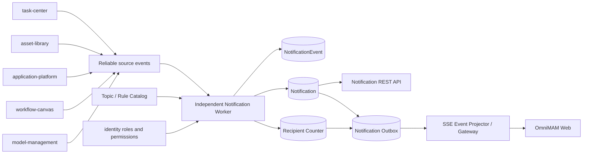

# Notification Center Domain Architecture

Notification Center 是可靠业务结果到用户持久通知的规则化投影，不是任务、素材、应用、画布、Provider 或系统状态的事实源。产品语义以 `00_product/domains/notification-center/product-spec.md` 为准，实现契约以 `01_contracts/domains/notification-center/` 为准。

## 1. 模块关系

## 2. 处理与一致性

- 业务领域事实与 source event 同事务提交；Notification Worker 至少一次消费并按 source event、topic 和 recipient 幂等。
- NotificationEvent 保存最小安全候选，Notification 保存用户可见历史摘要；两者都不能覆盖源业务事实。
- 聚合使用 recipient、topic、source 和时间窗口唯一键；同一源聚合只接受更高版本。
- Notification、recipient counter 和 Notification Outbox 在同一事务中更新。SSE 投影失败不回滚收件箱。
- Worker 与 Task Center 执行 Worker、业务 API、SSE Gateway 和未来渠道 Worker 独立扩缩容。

## 3. 数据所有权

- notification-center：topic catalog、NotificationEvent、Notification、event link、recipient counter、Preference、Delivery 预留和 Notification Outbox。
- 业务源领域：AtomicTask、Artifact、AssetVersion、ApplicationRun、EngineInstance、ProviderModel、CanvasRun 及各自 outbox。
- sse：短期 UserEvent、event_id、重放游标和连接；不拥有 Notification。
- identity：用户、角色和权限事实；notification-center 只消费当前主体和管理员候选范围。

跨域只通过可靠事件和受控 API 协作，不建立跨域数据库外键，不访问其他领域私有表。

## 4. 部署与恢复

- Notification Worker 可多副本运行，依赖数据库唯一键、行锁或等价原子更新处理并发聚合。
- source event 失败独立重试并进入死信；Notification Outbox 独立重试 SSE 投影，两者都不回滚源事实。
- counter 异常时从当前 recipient 的 Notification 重建；NotificationEvent 可按保留期清理，但先保留聚合来源关系所需窗口。
- 首期只启用站内通知。Email、Webhook 和 mobile push 各使用独立 Delivery Worker，不复用规则 Worker 或 SSE Gateway。

## 5. 首期门禁

- 只有 topic catalog 中 `ACTIVE + enabled=true` 的主题运行；`CONTRACT_GAP` 和 `FUTURE` 保持禁用。
- 公共 API 只允许当前用户读取和管理自己的收件箱与偏好，不提供通知创建、规则管理或跨用户查询。
- 实时提示只使用 `/api/v1/events/stream`，不存在 notification 私有 stream 或 Broker。
- action path 只能从结构化 navigation target 通过同源白名单路由派生，目标 API 始终重新鉴权。
