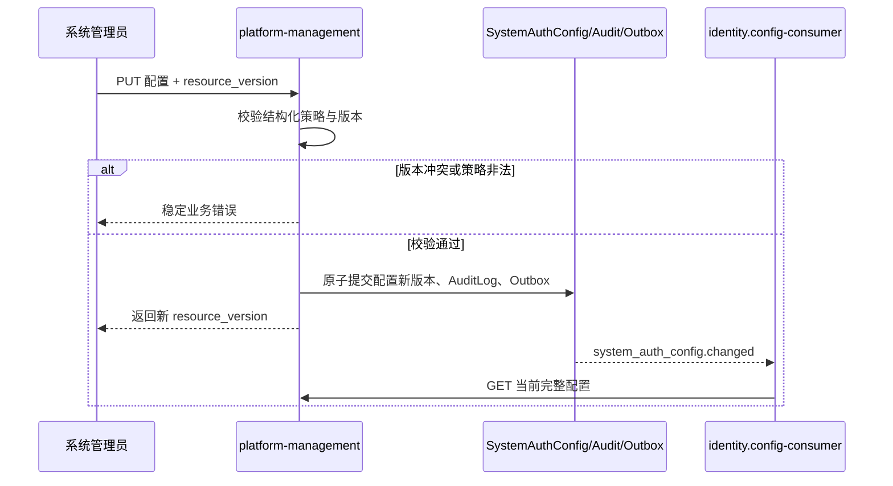
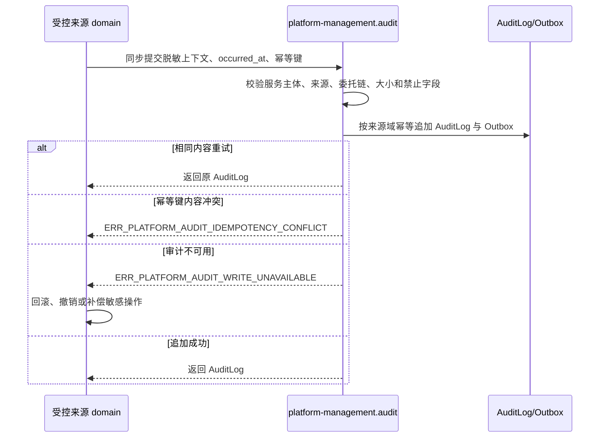

# 平台管理领域架构参考

## 1. 事实源

- S1：`00_product/domains/platform-management/product-spec.md`
- S2：`01_contracts/domains/platform-management/`

本文档只提炼平台管理的模块关系和跨域链路，不替代 S1/S2。当前领域仍为未 Release 草稿。

## 2. 模块划分

| 模块 | 架构职责 | 主要事实 |
| --- | --- | --- |
| `overview` | 组合只读运行/部署元数据和最近认证配置变更审计摘要 | `PlatformOverview`，无独立表 |
| `auth-config` | 管理单例 SystemAuthConfig、结构化校验、乐观并发和配置变更 Outbox | `platform_system_auth_configs` |
| `audit` | 校验来源服务主体、脱敏、幂等追加、查询 AuditLog 和发布 Outbox | `platform_audit_logs`、`platform_outbox_events` |

## 3. 依赖与边界

- 依赖 `identity` 校验管理员 JWT、权限码和内部 ServiceAccount Token；平台管理不读取 Identity 私有表。
- `identity` 通过内部读取接口消费当前 `SystemAuthConfig`，通过内部追加接口同步提交敏感操作审计。
- 其他 domain 后续接入审计时必须登记来源服务主体和 `source_domain/source_module`，不能直接写平台审计表。
- Overview 当前不读取 asset、application、model、task 或 notification 私有表，也不复制其统计事实。
- AuditLog 中的 principal、actor、owner 和 target ID 是历史稳定引用，不在列表或详情中递归展开当前资源摘要。

## 4. 认证配置链路

配置变更事件只提示版本失效。Identity 必须重新读取完整配置，不得从事件 payload 拼装认证策略。

## 5. 审计写入链路

Identity 可靠事件不作为 AuditLog 写入通道。敏感操作在审计失败后不得留下可用会话、凭据或授权效果并显示为成功。

## 6. 查询与一致性

- AuditLog 默认按 `occurred_at DESC, id DESC` 分页；`created_at` 只表示平台接收时间。
- 幂等作用域为 `source_domain + source_module + idempotency_key`；内容指纹用于识别错误复用。
- `detail` 只保存有界脱敏 JSON，不参与关键词扫描；常用来源、主体、目标、动作、结果、请求和时间字段使用独立索引。
- AuditLog 只追加，不提供更新或删除 API；第一阶段不提供归档和清理能力。
- `platform.audit.recorded` 第一阶段没有强制消费者，后续消费者必须先在对应 S1/S2 登记。

## 7. S2 合同入口

- `01_contracts/domains/platform-management/openapi.yaml`：概览、认证配置、审计查询和内部协作 API。
- `01_contracts/domains/platform-management/schema.sql`：SystemAuthConfig、AuditLog 和 Outbox 设计态 Schema。
- `01_contracts/domains/platform-management/errors.yaml`：overview、auth-config 和 audit 错误码。
- `01_contracts/domains/platform-management/permissions.yaml`：管理员与内部服务主体权限边界。
- `01_contracts/domains/platform-management/events.yaml`：配置失效提示与 AuditLog 追加事件。
- `01_contracts/domains/platform-management/module-contract.md`：跨域认证、幂等、fail-closed 和查询预算合同。
