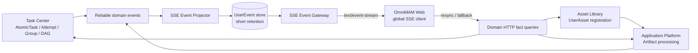
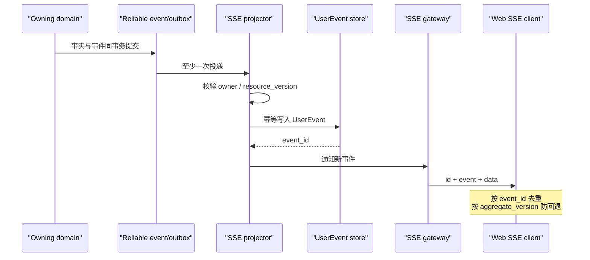
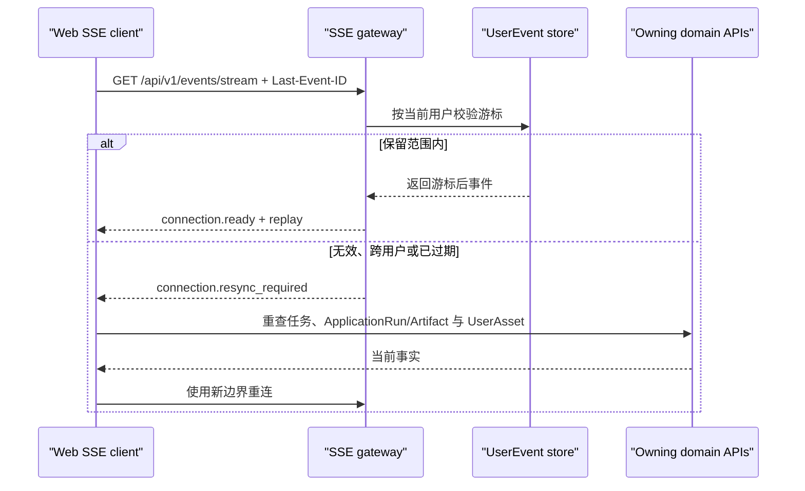

# SSE Domain Architecture

SSE 领域是用户级短期事件投影与 HTTP `text/event-stream` 网关，不是 AtomicTask、Artifact 或 UserAsset 的事实源。实现契约以 `01_contracts/domains/sse/` 为准。

## 1. 模块关系



Task Center 发布 AtomicTask、TaskAttempt 和 Group/DAG 变化。Application Platform 发布 Artifact 处理与登记投影变化；Asset Library 仍是 UserAsset 及登记成功的事实源。

## 2. 实时与重放时序



UserEvent 必须先持久再广播。广播失败不会丢失恢复能力；上游重复投递由 source event 幂等键去重。

## 3. 断线恢复



游标校验始终包含当前 `recipient_user_id`。无法恢复时必须回到业务 API 重同步，不允许从事件推测完整事实。

## 4. Artifact 事件边界

Artifact 有两个独立维度：

```text
processing_status: created -> transferring -> processing -> ready | failed -> deleted
registration_status: pending -> registered | failed
```

`artifact.preview_ready` 是 processing 期间的独立事实，不跳过处理状态。`artifact.registration_succeeded` 关联 UserAsset，但 Artifact 删除不级联删除 UserAsset。已终态 AtomicTask 不被后续 Artifact 处理或登记失败反向改写。

## 5. 运行时要求

- 网关关闭代理缓冲，支持长连接、心跳和优雅排空。
- API 实例无需粘性会话；新实例通过共享 UserEvent 存储和 Last-Event-ID 恢复。
- 单连接发送缓冲有上限；慢客户端关闭后由重连恢复，不无限缓存。
- 事件默认保留 24 小时；清理只影响 UserEvent，不影响业务资源。
- 可观测指标至少包含当前连接数、投影延迟、发送延迟、重连率、重放量、resync 量、慢客户端关闭和清理失败。指标 label 不包含 user_id 或 aggregate_id 等无界值。
