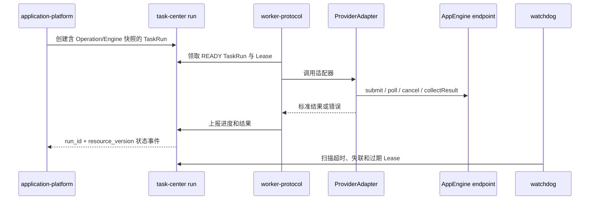

# 任务中心领域架构参考

## 1. 事实源

- S1：`00_product/domains/task-center/product-spec.md`
- S2：`01_contracts/domains/task-center/`

任务中心负责任务定义、TaskRun 唯一执行状态、Worker 协议、Lease、调度和故障恢复，不解释 ProviderAdapter、AppEngine 或平台调用协议。

## 2. 模块划分

| 模块 | 架构职责 | 主要资源 |
| --- | --- | --- |
| definition | AtomicTask、TaskGroup、DAGFlowTask 定义 | task_definitions |
| run | TaskRun 状态、版本、取消、重试和结果引用 | task_runs、task_run_events |
| worker-protocol | Worker、Attempt、Lease、进度和结果回写 | task_workers、task_attempts、task_execution_leases |
| watchdog | 扫描失联、过期、超时和停滞 | task_watchdog_records |
| scheduler | 创建系统维护 TaskRun | task_definitions、task_runs |
| access | 项目、命名空间和调用主体权限 | 访问控制聚合 |

## 3. 外部依赖

- application-platform 创建应用 TaskRun，并提供 ProviderAdapter、AppEngine 路由结果和标准输出语义。
- Worker 调用 ProviderAdapter；Adapter 使用 AppEngine endpoint、认证和能力快照访问平台。
- asset-library 保存大型媒体，TaskRun 只保存摘要和引用。
- identity 提供调用主体和权限边界。

## 4. 核心链路

## 5. 一致性

- TaskRun 是执行状态唯一事实源，每次状态、进度和结果变化递增 resource_version。
- 消费者按 run_id + resource_version 幂等处理，旧事件不得覆盖新投影。
- 同一 TaskRun 同时只能有一个有效 Lease。
- TaskAttempt 保留每次失败和 external_job_id；重试先恢复已有外部任务。
- Worker 负责生命周期，ProviderAdapter 负责平台协议，AppEngine 只提供实例配置和状态。
- 取消由 Worker 调用 ProviderAdapter 协作完成，最终状态仍可能是 SUCCESS、FAILED、CANCELED 或 TIMEOUT。

## 6. 风险

- Worker 失联和第三方异步任务仍运行时，必须依靠 external_job_id 恢复，避免重复提交。
- 状态事件可能乱序或重复，所有投影必须使用 resource_version。
- 大型结果不得进入 TaskRun output 正文。
