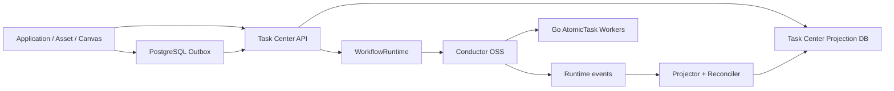

# 任务中心领域架构参考

## 1. 架构定位

Task Center 是业务任务唯一入口和投影事实源，Conductor OSS 是内部执行与编排运行时。Watermill 与 PostgreSQL outbox 连接素材上传等领域事件；其他领域不得直接依赖 Conductor API、数据库或 UI。

## 2. 核心组件

| 组件 | 职责 |
| --- | --- |
| AtomicTask service | 创建、查询、取消、手动重试和 Attempt 历史 |
| Orchestration service | 展开 Group/DAG、编译定义和聚合状态结果 |
| Schedule service | 计划管理、ScheduleExecution、活动锁和重叠跳过 |
| Function registry | 将受控 functionRef 映射到 Worker handler 和 schema |
| ConductorRuntime | 注册、启动、查询、取消、Schedule 和事件适配 |
| Projection consumer | 幂等消费运行时事件并推进业务投影 |
| Reconciler | 周期对账全部非终态执行并修复遗漏 |

## 3. 编译模型

- AtomicTask 编译为一个 SIMPLE task。
- SERIAL TaskGroup 编译为顺序 SIMPLE tasks。
- PARALLEL TaskGroup 编译为 Fork/Join，执行门禁限制 `max_parallelism`。
- DAGTaskGroup 按拓扑层编译，同层 Fork、层末 Join；动态节点使用 Dynamic Fork/Join。
- CanvasVersion 与 DAGTaskGroup 内容摘要形成不可变 workflow definition 名称和版本。
- ComfyUI 使用 `submit -> poll -> download_artifact`；poll 使用 callback/delay 并保存外部 job ID。
- ComfyUI WorkflowTestRun 使用 `submit -> poll -> collect_preview`；Worker 返回 `IN_PROGRESS + callbackAfterSeconds` 后由 Conductor 延迟重投同一 task，期间释放 Worker。

## 4. 调度模型

cron 由 Conductor Scheduler 触发，单次 `run_at` 由持久化 WAIT launcher 触发。Task Center 在每次触发入口先写唯一 ScheduleExecution 并获取 schedule 活动锁；存在非终态轮次时写 `SKIPPED_OVERLAP`。停机期间的历史周期不补发。

调度触发创建的目标继承 TaskSchedule 的租户和创建者边界。查询 ScheduleExecution 时按 target type 批量读取实际目标并形成轻量摘要；查询全局 AtomicTask、TaskGroup 和 DAGTaskGroup 时通过 ScheduleExecution 批量反查来源计划。触发失败、重叠跳过或目标已不可用时使用计划模板摘要降级，不伪造目标资源。

## 5. 恢复与一致性

- 业务创建、幂等记录和 outbox 同事务提交。
- 运行时启动使用稳定 correlation ID，可在 API 重启后重放而不产生重复执行。
- 自动重试增加 TaskAttempt；手动重试增加 AtomicTask 或新 Group/DAG。
- 投影仅接受更高运行时序列，业务 `resource_version` 单调递增。
- reconciler 对账非终态 execution，因此 Worker、Conductor、API 或消息消费者重启不依赖内存状态恢复。
- 运行时不可用时保留可恢复业务状态，不启用旧 Dispatcher 或双写旧 TaskRun。

## 6. 数据所有权

Task Center 拥有 AtomicTask、Attempt、Group、DAG、Schedule、ScheduleExecution、runtime binding 和 projection event。Conductor 拥有其 workflow/task/schedule 内部历史，并使用独立数据库或 schema。application-platform 拥有 ApplicationRun/Artifact，asset-library 拥有 Asset，workflow-canvas 拥有 Canvas 版本和运行视图。

## 7. 安全边界

Task Center 根据服务身份和用户权限解析 functionRef，拒绝用户提供的任意 HTTP、INLINE、脚本、Worker 名、凭证和内部运行时配置。所有列表、详情、取消和重试都应用 project/namespace/owner 过滤；内部运维访问也必须审计。
