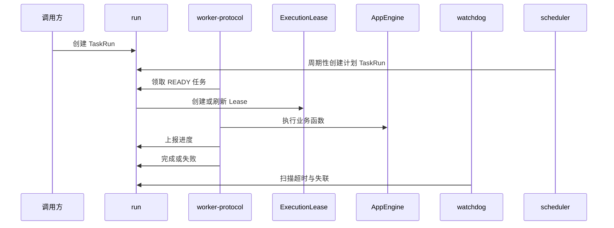

# 任务中心领域架构参考

## 1. 事实源

- S1：`00_product/domains/task-center/product-spec.md`
- S2：`01_contracts/domains/task-center/`

任务中心负责底层任务定义、运行状态、Worker 协议、Lease、系统周期性调度和故障恢复，不负责具体业务函数、应用引擎实现或外部执行器细节。

## 2. 模块划分

| 模块 | 架构职责 | 主要资源 |
| --- | --- | --- |
| `definition` | 管理 AtomicTask、TaskGroup、DAGFlowTask 定义 | `task_definitions` |
| `run` | 管理 TaskRun 创建、状态流转、取消、重试、结果引用 | `task_runs`、`task_run_events` |
| `worker-protocol` | 管理 Worker 注册、心跳、领取、进度、完成、失败和 Lease 续约 | `task_workers`、`task_attempts`、`task_execution_leases` |
| `watchdog` | 扫描 Worker 心跳超时、Lease 过期、任务超时和长时间无进度 | `task_watchdog_records` |
| `scheduler` | 为系统内部维护任务周期性创建计划执行的 TaskRun | `task_definitions`、`task_runs.schedule_at` |
| `access` | 控制项目、命名空间、调用主体和用户权限边界 | 访问控制聚合 |

## 3. 外部依赖

- 依赖 `identity` 提供调用主体、当前用户和权限边界。
- 被 `application-platform` 或后续业务模块调用，用于创建和追踪应用运行。
- 与 AppEngine 协作时，任务中心只表达运行状态和调度协议，AppEngine 负责业务执行解释。
- 与 `asset-library` 协作时，任务中心可周期性触发 `asset.sha256_backfill`，但素材库负责具体扫描、读取素材、计算 SHA256 和写回。

## 4. 核心链路

## 5. 状态与一致性

- TaskRun 状态包括 `PENDING`、`READY`、`CLAIMED`、`RUNNING`、`RETRYING`、`CANCEL_REQUESTED`、`PAUSED`、`SUCCESS`、`FAILED`、`CANCELED`、`TIMEOUT`、`LOST`。
- TaskAttempt 状态包括 `CLAIMED`、`RUNNING`、`SUCCESS`、`FAILED`、`TIMEOUT`、`CANCELED`、`WORKER_LOST`、`LEASE_EXPIRED`、`STALLED`。
- 同一运行的状态变更应写入 `task_run_events`，便于失败排查和事件重放。
- Lease 当前只允许同一运行存在一个 `ACTIVE` 或 `RENEWED` 执行租约。
- 取消是协作式语义，Worker 与 AppEngine 需要持续检查取消请求。
- 系统周期性调度创建的 TaskRun 仍遵循普通 TaskRun 状态机、Worker 领取、Lease、重试和结果回写规则。

## 6. API 面

S2 OpenAPI 将能力拆为：

- `/api/v1/task-definitions`
- `/api/v1/atomic-tasks`
- `/api/v1/task-groups`
- `/api/v1/dag-flow-tasks`
- `/api/v1/task-runs`
- `/api/v1/task-runs/{run_id}`
- `/api/v1/task-runs/{run_id}/attempts`
- `/api/v1/task-runs/{run_id}/cancel`
- `/api/v1/task-runs/{run_id}/retry`
- `/api/v1/workers`
- `/api/v1/workers/{worker_id}/heartbeat`
- `/api/v1/workers/{worker_id}/claim`
- `/api/v1/task-runs/{run_id}/progress`
- `/api/v1/task-runs/{run_id}/complete`
- `/api/v1/task-runs/{run_id}/fail`
- `/api/v1/leases/{lease_id}/renew`
- `/api/v1/task-center/health`

## 7. 架构风险

- Worker 失联、Lease 过期和任务超时必须有明确优先级，避免重复执行或状态回退。
- DAG 与 TaskGroup 执行需要保证定义不可被运行中实例隐式修改。
- 结果内容不应无限写入任务中心，S1/S2 倾向存储结果引用和摘要。
- Watchdog 处理应可追踪，避免后台修复动作不可审计。
