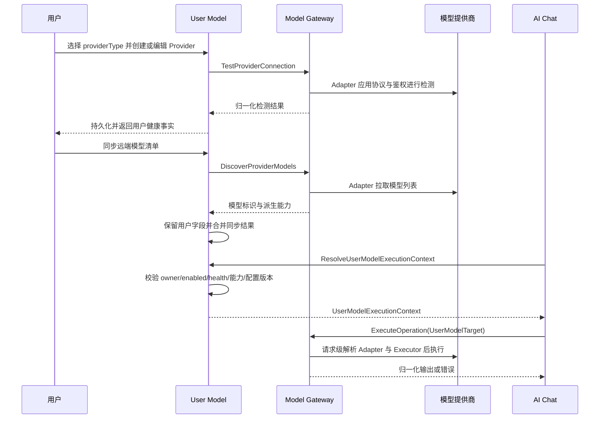

# User Model 领域架构参考

## 1. 事实源

- S1：`00_product/domains/user-model/product-spec.md`
- S2：`01_contracts/domains/user-model/`

本文档描述 User Model 与 Model Gateway 的协作架构，不替代 S1/S2。

## 2. 模块划分

| 模块 | 架构职责 | 主要资源 |
| --- | --- | --- |
| `provider-type` | 读取 Gateway 提供的稳定 Provider Type 目录，不暴露 Adapter/Executor ID | 只读聚合 |
| `provider` | 管理当前用户的 Provider、连接配置和检测结果；实际检测委托 Gateway | `user_model_providers`、`model_health_checks` |
| `model` | 管理 Provider 下的模型清单、用户字段、健康事实和启用范围；发现与探测委托 Gateway | `user_provider_models`、`model_health_checks` |
| `default-model` | 管理不同用途的默认模型选择 | `user_default_model_configs` |
| `option` | 向下游领域提供当前用户可用模型只读选项 | 只读聚合 |
| `execution-context` | 校验 owner、enabled、health、能力和配置版本并签发请求级执行上下文 | 不持久化 |

## 3. 外部依赖与被依赖

- 依赖 `identity` 提供当前用户身份、资源归属和权限边界。
- 依赖 `modelgateway` 提供 Provider Type 目录、Adapter 模型发现/探测、能力派生和统一 Operation 执行。
- 被 `ai-chatting` 依赖，用于助手建议模型、聊天默认模型、翻译模型、执行资格校验和 `UserModelExecutionContext`。
- Gateway 不读取 User Model 私有表；User Model 不维护 Provider 专用 HTTP 客户端。跨域凭证只通过不透明 `credentialHandle` 使用，不传递明文。

## 4. 核心链路

## 5. 状态与一致性

- 模型健康状态使用 `unknown`、`healthy`、`unhealthy`。
- 提供商删除、模型删除和默认模型配置之间必须保持引用一致性；默认模型不能指向不可用或不可见模型。
- 连接检测和模型检测写入检测记录，但不应替代模型配置本身。
- 同步远端模型清单应以逐项结果表达创建、更新和跳过，不应只返回整体成功。
- 同步不得覆盖用户维护的显示名、分组、启用状态或 `feature_labels`。
- `feature_labels` 不参与执行能力判断；最终可执行能力是 Adapter 支持、ProviderCapability 或探测结果与用户启用范围的交集。
- `capability_definition_ids`、`executable`、`unavailable_reason` 和能力解析状态是 Gateway 派生只读字段；能力失效不删除或改写用户模型。
- ProviderModel 查询以固定批次读取当前 owner 的 Provider 名称并填充 `provider_name`；删除或不可见 Provider 的模型不得通过投影泄露 Provider 信息。
- `UserModelExecutionContext` 和 `ResolvedModelRoute` 均不建表；停用、不健康、能力不匹配或配置版本过期时不得进入 Provider 调用。

## 6. API 面

S2 OpenAPI 将能力拆为：

- `/api/v1/user-model/provider-types`
- `/api/v1/user-model/providers`
- `/api/v1/user-model/providers/test`
- `/api/v1/user-model/providers/{provider_id}`
- `/api/v1/user-model/providers/{provider_id}/test`
- `/api/v1/user-model/providers/{provider_id}/models`
- `/api/v1/user-model/providers/{provider_id}/models/sync`
- `/api/v1/user-model/models/{model_id}`
- `/api/v1/user-model/models/{model_id}/test`
- `/api/v1/user-model/defaults/{usage}`
- `/api/v1/user-model/options`

旧 `/model-providers`、`/provider-models`、`/default-models` 和 `/model-options` 不保留别名、重定向或兼容路由。

## 7. 架构风险

- 下游领域不得持久化模型密钥或提供商完整配置。
- 模型健康检测可能较慢，应避免阻塞列表查询和默认模型读取。
- Provider Type 必须映射到已注册 Adapter；任何客户端提交的 `adapter_id` 或 Provider 地址都必须拒绝。
- 未保存 Provider 测试不得落库；Gateway 错误必须由 User Model 映射为既有 `ERR_MODEL_*`，不能暴露内部 Adapter 或凭证信息。
- `usage` 当前限定为 `assistant.default`、`quick`、`translation`；新增用途需要先更新 S1/S2。
