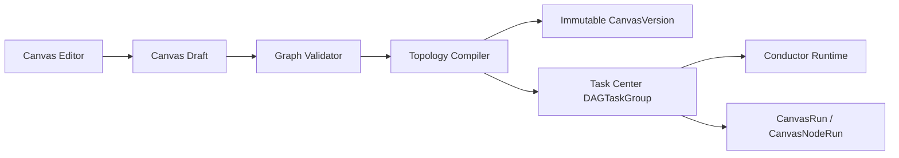

# 工作流画布领域架构参考

## 1. 架构定位

workflow-canvas 提供无限画布的编辑、版本和运行视图；它不实现执行引擎。发布阶段把用户图编译为 task-center DAGTaskGroup template，运行阶段通过 Task Center 启动并投影节点状态。

## 2. 编译流程

1. 规范化节点、边、端口和 input binding，计算内容摘要。
2. 校验无环、引用完整、functionRef/ApplicationVersion 授权和规模上限。
3. 拓扑分层；同层节点并行，层间使用 Join 保证所有父依赖。
4. DYNAMIC_FORK 节点声明模板和最大展开数，运行时展开后 Join。
5. 注册不可变 workflow definition，再原子保存 CanvasVersion 和编译绑定。

V1 的拓扑分层会等待同层所有节点后再进入下一层，优先保证任意 DAG 的正确性；后续只有在保持依赖语义和版本兼容时才能优化为最早释放。

## 3. 运行与投影

CanvasRun 固定 CanvasVersion 和输入快照，以稳定幂等键创建唯一 DAGTaskGroup。静态 CanvasNodeRun 关联 AtomicTask；动态展开任务按 owner/child key 查询。task-center 的资源版本单调推进画布投影，定期对账修复漏事件。

## 4. 数据所有权

- workflow-canvas：Canvas、CanvasVersion、CanvasRun、CanvasNodeRun 和编译摘要。
- task-center：DAGTaskGroup、AtomicTask、Attempt、运行状态、取消和重试。
- application-platform：ApplicationVersion、ApplicationRun 和 Artifact 引用映射。
- asset-library：Artifact、Asset、AssetVersion 和 Representation。

画布不得复制 Conductor workflow/task 历史，也不得将 Conductor ID 暴露为产品主键。

## 5. 风险控制

- 草稿并发编辑通过 revision 防止静默覆盖。
- 发布版本不可变，确保历史运行可复现。
- functionRef 白名单和 schema 校验阻断 SSRF/RCE 与跨租户注入。
- 节点、边、动态展开和 JSON 大小限制阻断资源耗尽。
- 重启恢复依赖 Task Center/Conductor 持久化事实，不依赖浏览器或 API 内存状态。
