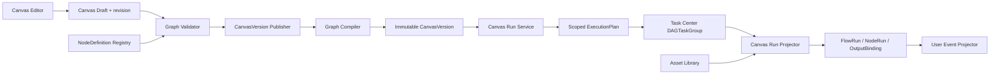
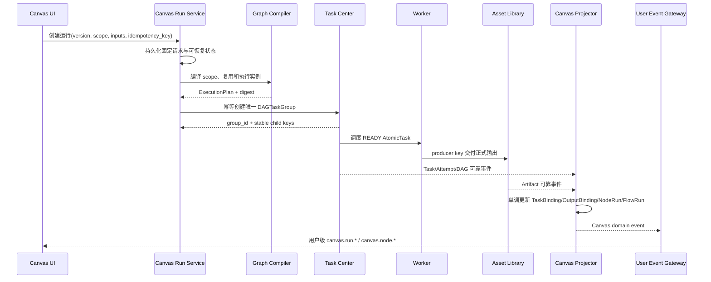
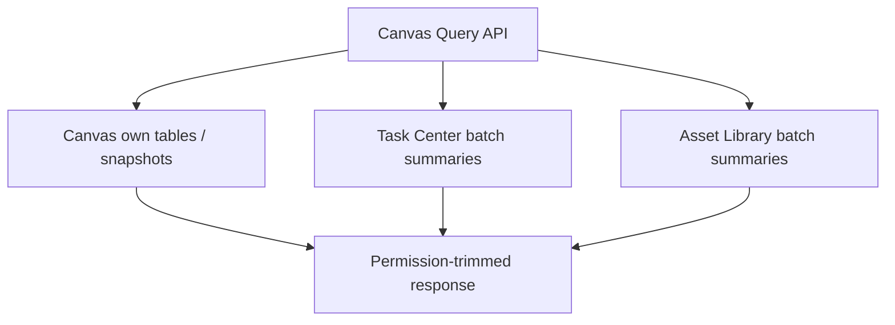

# 工作流画布领域架构参考

## 1. 架构定位

workflow-canvas 拥有无限画布编辑事实、不可变版本、确定性 ExecutionPlan 和面向画布的运行投影，但不实现任务调度、Artifact 生命周期或用户级实时网关。



## 2. 发布与运行编译

发布和运行采用两阶段编译：

```text
完整草稿
  -> 校验节点、端口、流、引用、类型、无环和规模
  -> 规范化完整 DAGTaskGroup template
  -> 按内容摘要注册不可变 workflow definition
  -> 保存 CanvasVersion

CanvasVersion + scope + runtime inputs + reuse policy
  -> 校验输入闭包
  -> 计算执行指纹和复用决策
  -> 对共享执行实例去重
  -> 展平 fan-out/复合节点
  -> 生成唯一 DAGTaskGroup ExecutionPlan
```

编译器保留真实直接依赖，不用“同一拓扑层整体等待”替代 DAG 语义。A、B 并行且 C 只依赖 A 时，C 可以在 A 满足后进入 READY，不必等待同层无关的 B；实际释放仍由 Task Center 决定。

流不是 Group。多个流是同一 DAGTaskGroup 中的依赖分量，CanvasFlowRun 只引用一组 `execution_key`。一个 NodeRun 可以被多个 FlowRun 引用，只有指纹、依赖来源和策略完全一致时才共享。

## 3. 运行与投影



NodeRun 到任务的基数是 1:N：普通节点通常一个 AtomicTask，fan-out/复合节点多个，Data/Viewer/REUSED/client-generated 可以为零。动态任务通过 DAG owner、稳定 child key 和 shard key 批量绑定，不能从 Worker 名或运行时内部 ID 猜测。

Task Center 和 Asset Library 事件属于不同聚合。投影分别按资源版本单调应用，AtomicTask 成功后仍需等待必需结构化输出持久化与 Artifact READY；漏事件通过事实源批量查询和持久游标对账。

## 4. 数据所有权

- workflow-canvas：NodeDefinition、Canvas、CanvasVersion、CanvasRun、CanvasFlowRun、CanvasNodeRun、任务绑定、输出绑定、Canvas outbox 和对账游标。
- task-center：workflow runtime 定义、DAGTaskGroup、AtomicTask、TaskAttempt、调度、自动重试、取消和任务状态。
- asset-library：Artifact 正文、存储、处理状态、预览、下载、删除和资源版本。
- application-platform：ApplicationVersion、ApplicationRun 和应用执行能力。
- sse：当前用户短期可重放 UserEvent、event_id、连接和 Last-Event-ID 恢复。

跨域只保留稳定 ID、创建时非敏感快照和已观察版本，不建立跨域数据库外键，不穿透私有表。

## 5. 查询路径与预算



列表页对每个外部事实源使用一次有界批量读取，不能按行查询。关联资源不可见或删除时保留 ID、摘要为 null；历史版本与重跑来源优先展示创建时快照，避免当前可变资源改写历史事实。

## 6. 风险控制

- draft revision 防止多标签页或多人编辑静默覆盖。
- 内容寻址和不可变版本保证发布、重启恢复与历史重放确定性。
- functionRef/ApplicationVersion 白名单、schema 与引用权限校验阻断 SSRF、RCE 和跨租户注入。
- 1000 节点、5000 边、动态展开上限、JSON 大小和配额阻断资源耗尽。
- 稳定运行幂等键与唯一 DAGTaskGroup 绑定阻断启动窗口重复执行。
- Artifact producer key、输出槽位唯一键和 aggregate version 阻断自动重试产生重复逻辑制品。
- `selected_subgraph`、容错 Join、流/分片级取消和分片重跑在依赖契约成熟前保持禁用。
