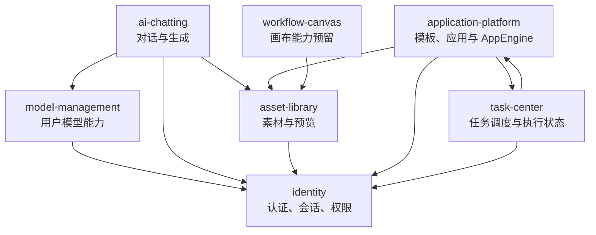
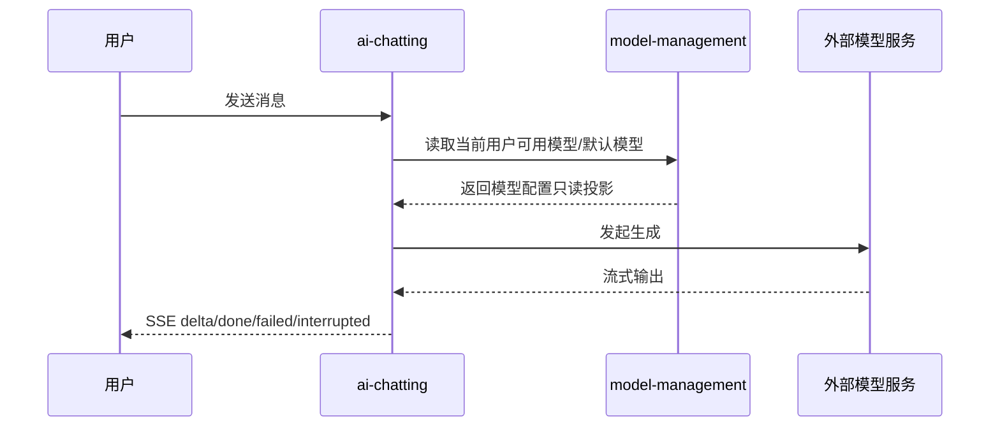
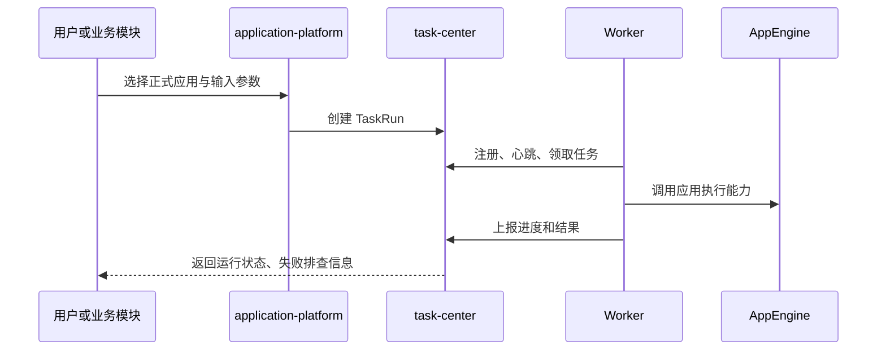

# OmniMAM 全局架构参考

## 1. 定位

本文档从 S1 产品语义与 S2 实现契约中提炼系统级架构参考，不替代 S1/S2 事实源。

- 产品语义以 `00_product/` 为准。
- API、设计态 schema、错误码、权限码、事件与模块边界以 `01_contracts/` 为准。
- 本目录用于说明领域划分、依赖方向、运行链路和跨域协作约束。

## 2. 领域划分

| 领域 | 架构职责 | 当前事实源状态 |
| --- | --- | --- |
| `identity` | 统一认证、会话、Token、RBAC、权限资源、审计 | 已有 S1，S2 待补 |
| `model-management` | 用户模型提供商、模型清单、健康检测、默认模型 | 已有 S1/S2 |
| `ai-chatting` | 话题、消息、生成运行、助手、快捷短语、翻译 | 已有 S1/S2 |
| `asset-library` | 用户素材、上传会话、预览、处理任务、画布输出资产 | 已有 S1，S2 已有 schema，其他契约待补 |
| `application-platform` | 应用模板、正式应用、字段映射、用户级 AppEngine | 已有 S1/S2 |
| `task-center` | 任务定义、运行实例、Worker 协议、Lease、Watchdog | 已有 S1/S2 |
| `workflow-canvas` | 工作流画布能力预留 | 缺少 S1，S2 暂未定义业务表 |

## 3. 依赖方向

说明：

- `identity` 是横向基础能力，其他领域通过当前用户、权限码和审计语义依赖它。
- `ai-chatting` 只读取 `model-management` 的用户模型配置，不维护独立模型清单。
- `application-platform` 定义应用、字段映射、SaaS 平台元数据和用户级 AppEngine；不直接承担应用运行，运行链路交给 `task-center`，AppEngine 只表达用户维护的运行平台、明文凭证、custom_http 配置与健康状态。
- `task-center` 只管理任务定义、运行状态、Worker 协议与故障恢复，不理解具体业务执行逻辑。
- `asset-library` 是用户素材与生成产物的资产事实源，供聊天、应用和画布能力引用。

## 4. 运行链路

### 4.1 聊天生成链路

### 4.2 应用运行到任务执行链路

## 5. 数据与事件原则

- 各领域只拥有自身核心资源表，跨领域通过资源 ID、只读投影或引用关系协作。
- S2 `schema.sql` 是设计态 schema，不是实际 migration。
- 需要异步状态的领域应通过事件契约表达状态变化；若事件文件为空，应视为 S2 待补齐，而不是默认无事件。
- 批量、分页、错误响应和 `/api/v1` 路径语义遵循 S2 规则。

## 6. 当前架构缺口

- `identity` 只有 S1，尚缺 S2 契约，其他领域的权限集成只能按 S1 语义描述。
- `asset-library` 已有设计态 schema，但 OpenAPI、错误码、权限码、事件和模块契约为空。
- `workflow-canvas` 缺少 S1 产品事实源，S2 仅声明暂不定义业务表。
- 领域架构文档不得绕过这些缺口直接补写实现契约。
