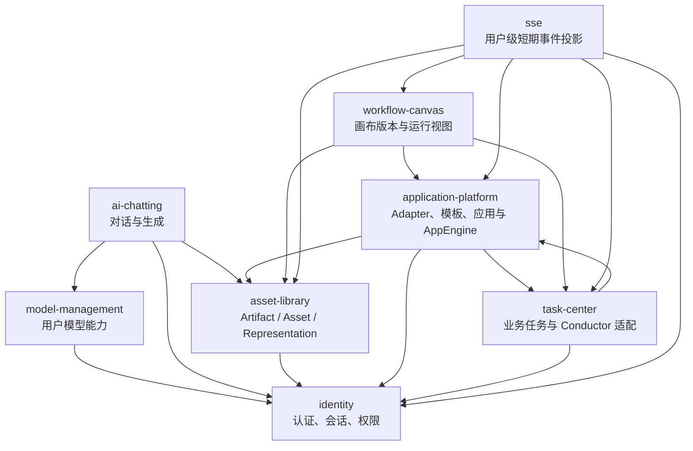
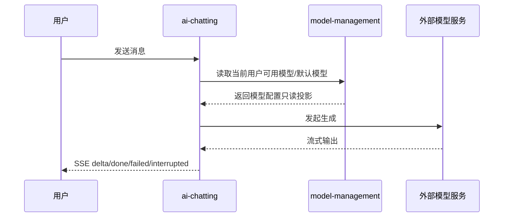
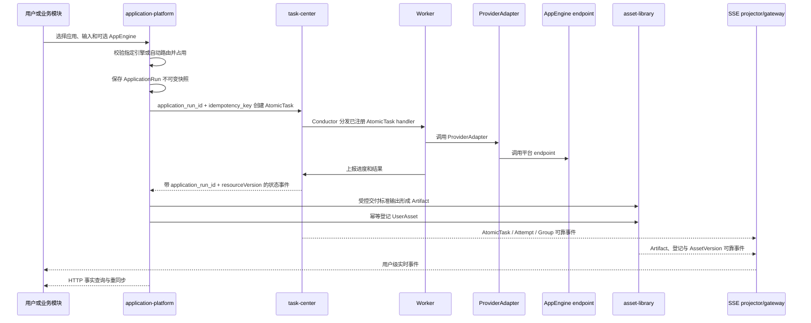

# OmniMAM 全局架构参考

## 1. 定位

本文档从 S1 产品语义与 S2 实现契约中提炼系统级架构参考，不替代 S1/S2 事实源。

- 产品语义以 `00_product/` 为准。
- API、设计态 schema、错误码、权限码、事件与模块边界以 `01_contracts/` 为准。
- 本目录用于说明领域划分、依赖方向、运行链路和跨域协作约束。

## 2. 领域划分

| 领域 | 架构职责 | 当前事实源状态 |
| --- | --- | --- |
| `identity` | 统一认证、会话、Token、RBAC、权限资源、审计 | 已有 S1，S2 待补 |
| `model-management` | 用户模型提供商、模型清单、健康检测、默认模型 | 已有 S1/S2 |
| `ai-chatting` | 话题、消息、生成运行、助手、快捷短语、翻译 | 已有 S1/S2 |
| `asset-library` | Artifact、用户素材、AssetVersion、Representation、存储、派生任务与周期补全 | 已有 S1/S2，部分普通素材 API 待补 |
| `application-platform` | Runtime Registry、ProviderCapability、模板/应用版本、Engine、ApplicationRun 与 Artifact 引用投影 | 已有 S1/S2 |
| `task-center` | AtomicTask、Group/DAG 编排、Schedule、运行时适配与状态投影 | 已有 S1/S2 |
| `workflow-canvas` | 无限画布草稿、不可变版本、DAG 编译和运行视图 | 已有 S1/S2 |
| `sse` | 当前用户的短期可重放业务事件投影与 `text/event-stream` 网关 | 已有 S1/S2 草案 |

## 3. 依赖方向

说明：

- `identity` 是横向基础能力，其他领域通过当前用户、权限码和审计语义依赖它。
- `ai-chatting` 只读取 `model-management` 的用户模型配置，不维护独立模型清单。
- `application-platform` 定义只读 Runtime Registry、ProviderCapability、模板/应用版本、Engine 路由、ApplicationRun 投影和 Artifact 引用；EngineInstance 只表达运行实例配置和状态。
- `task-center` 管理 AtomicTask、Group/DAG、Schedule 和业务状态投影；Conductor 负责内部调度、自动重试、Worker 分发与故障恢复。
- `workflow-canvas` 发布不可变 CanvasVersion，并将多流、fan-out 和复合节点展平到唯一 task-center DAGTaskGroup；一个 CanvasNodeRun 可以映射零个、一个或多个 AtomicTask。
- `asset-library` 是 Artifact、Asset、AssetVersion、Representation 和生成产物处理的事实源，供聊天、应用和画布能力引用。
- `sse` 只投影 task-center 任务事件、asset-library Artifact/AssetVersion 事件、workflow-canvas 运行语义事件和 ApplicationRun 引用关联；不拥有上述业务事实。AI Chat 单次生成的 token/delta 流仍归 ai-chatting 请求边界，不进入本用户级事件历史。

## 4. 运行链路

### 4.1 聊天生成链路

### 4.2 应用运行到任务执行链路

## 5. 数据与事件原则

- 各领域只拥有自身核心资源表，跨领域通过资源 ID、只读投影或引用关系协作。
- S2 `schema.sql` 是设计态 schema，不是实际 migration。
- 需要异步状态的领域应通过事件契约表达状态变化；若事件文件为空，应视为 S2 待补齐，而不是默认无事件。
- 批量、分页、错误响应和 `/api/v1` 路径语义遵循 S2 规则。

## 6. 当前架构缺口

- `identity` 只有 S1，尚缺 S2 契约，其他领域的权限集成只能按 S1 语义描述。
- `asset-library` 的素材列表、批量打标、Artifact、AssetVersion 和 Representation 已有 S2；普通素材上传、下载、重命名、删除与完整分组 API 仍待补。
- workflow-canvas 首期编译保留直接 DAG 依赖并支持节点最早释放；多流、fan-out 和复合节点必须展平到唯一 DAGTaskGroup，不能使用 Group 嵌套或同层整体等待改变依赖语义。
