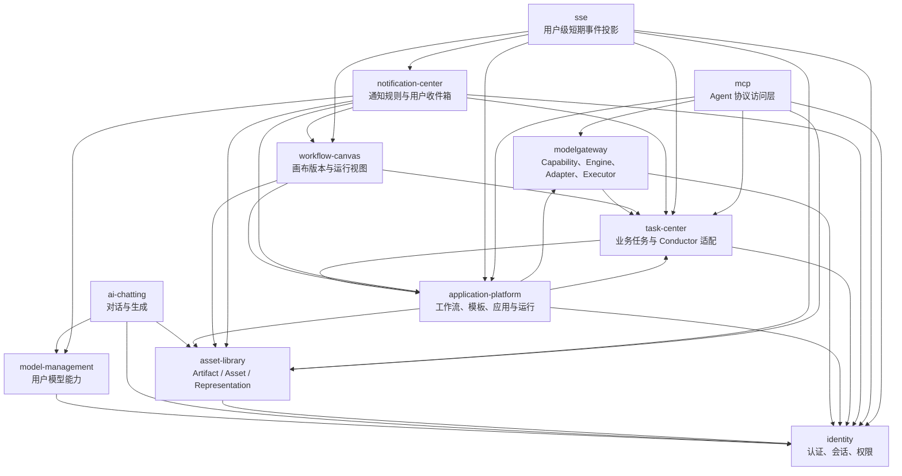
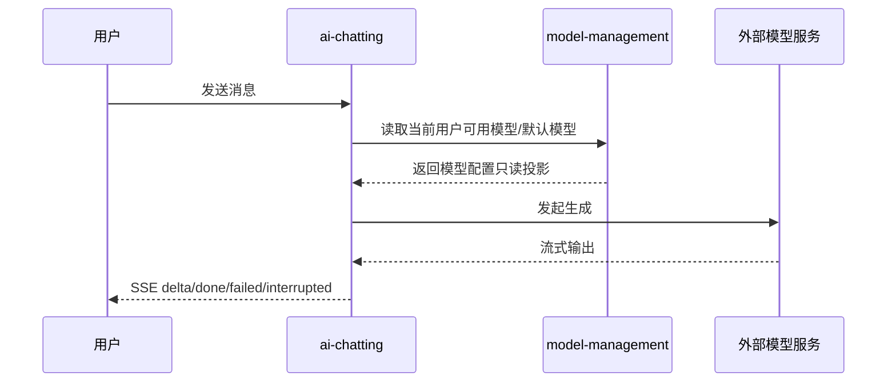
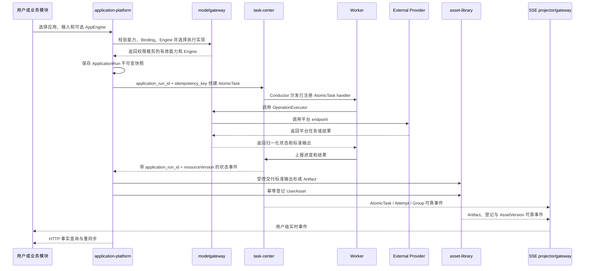
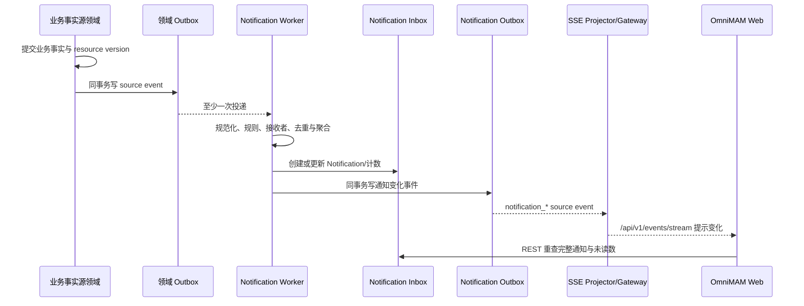

# OmniMAM 全局架构参考

## 1. 定位

本文档从 S1 产品语义与 S2 实现契约中提炼系统级架构参考，不替代 S1/S2 事实源。

- 产品语义以 `00_product/` 为准。
- API、设计态 schema、错误码、权限码、事件与模块边界以 `01_contracts/` 为准。
- 本目录用于说明领域划分、依赖方向、运行链路和跨域协作约束。

## 2. 领域划分

| 领域 | 架构职责 | 当前事实源状态 |
| --- | --- | --- |
| `identity` | 统一认证、会话、Token、RBAC、权限资源、审计 | 已有 S1，S2 待补 |
| `model-management` | 用户模型提供商、模型清单、健康检测、默认模型 | 已有 S1/S2 |
| `modelgateway` | Runtime Registry、ProviderCapability、Engine、Binding、Adapter、OperationExecutor 与 object_info | 已有迁移 S1/S2，待 Release |
| `ai-chatting` | 话题、消息、生成运行、助手、快捷短语、翻译 | 已有 S1/S2 |
| `asset-library` | Artifact、用户素材、AssetVersion、Representation、存储、派生任务与周期补全 | 已有 S1/S2，部分普通素材 API 待补 |
| `application-platform` | ComfyUIWorkflow、模板/应用版本、RuntimeFormSchema、ApplicationRun 与 Artifact 引用投影 | 已有 S1/S2 |
| `task-center` | AtomicTask、Group/DAG 编排、Schedule、运行时适配与状态投影 | 已有 S1/S2 |
| `workflow-canvas` | 无限画布草稿、不可变版本、DAG 编译和运行视图 | 已有 S1/S2 |
| `sse` | 当前用户的短期可重放业务事件投影与 `text/event-stream` 网关 | 已有 S1/S2 草案 |
| `notification-center` | 可靠源事件消费、通知规则、用户收件箱、偏好、聚合与 Notification Outbox | 已有 S1/S2，`spec-v1.8.0` released |
| `mcp` | MCP `2026-07-28`、固定 Tool/Resource、ApplicationRun Task 映射与 Agent 访问控制 | 已有 S1/S2，`spec-v1.9.2` released |

## 3. 依赖方向

```mermaid
graph TD
  Identity["identity<br/>认证、会话、权限"]
  Model["model-management<br/>用户模型能力"]
  Chat["ai-chatting<br/>对话与生成"]
  Asset["asset-library<br/>Artifact / Asset / Representation"]
  Gateway["modelgateway<br/>Capability、Engine、Adapter、Executor"]
  App["application-platform<br/>工作流、模板、应用与运行"]
  Task["task-center<br/>业务任务与 Conductor 适配"]
  Canvas["workflow-canvas<br/>画布版本与运行视图"]
  Notify["notification-center<br/>通知规则与用户收件箱"]
  SSE["sse<br/>用户级短期事件投影"]
  MCP["mcp<br/>Agent 协议访问层"]

  Chat --> Model
  Chat --> Asset
  App --> Gateway
  App --> Task
  App --> Asset
  Gateway --> Task
  Task --> App
  Canvas --> Task
  Canvas --> App
  Canvas --> Asset
  Notify --> Task
  Notify --> App
  Notify --> Asset
  Notify --> Canvas
  Notify --> Model
  SSE --> Notify
  SSE --> Task
  SSE --> App
  SSE --> Asset
  SSE --> Canvas
  MCP --> Gateway
  MCP --> App
  MCP --> Task
  MCP --> Asset

  Model --> Identity
  Chat --> Identity
  Asset --> Identity
  Gateway --> Identity
  App --> Identity
  Task --> Identity
  Notify --> Identity
  SSE --> Identity
  MCP --> Identity
```

说明：

- `identity` 是横向基础能力，其他领域通过当前用户、权限码和审计语义依赖它。
- `ai-chatting` 只读取 `model-management` 的用户模型配置，不维护独立模型清单。
- `modelgateway` 定义只读 Runtime Registry、ProviderCapability、Engine、Binding、Adapter、OperationExecutor、健康检测和 ComfyUI 当前 object_info。
- `application-platform` 定义 ComfyUIWorkflow、模板/应用版本、RuntimeFormSchema、ApplicationRun 投影和 Artifact 引用，通过受控边界消费 Model Gateway。
- `task-center` 管理 AtomicTask、Group/DAG、Schedule 和业务状态投影；Conductor 负责内部调度、自动重试、Worker 分发与故障恢复。
- `workflow-canvas` 发布不可变 CanvasVersion，并将多流、fan-out 和复合节点展平到唯一 task-center DAGTaskGroup；一个 CanvasNodeRun 可以映射零个、一个或多个 AtomicTask。
- `asset-library` 是 Artifact、Asset、AssetVersion、Representation 和生成产物处理的事实源，供聊天、应用和画布能力引用。
- `notification-center` 消费已登记业务领域 source event，规范化为 NotificationEvent 并生成用户 Notification；不读取其他领域私表或从低层任务终态猜测上层业务结果。
- `sse` 只投影 task-center、asset-library、workflow-canvas 和 notification-center 的可靠事件；不拥有上述业务事实。AI Chat 单次生成的 token/delta 流仍归 ai-chatting 请求边界，不进入本用户级事件历史。
- `mcp` 通过固定 Tool 和 Resource URI 读取受控领域投影，只通过 Application 创建异步运行，并将 ApplicationRun 的 AtomicTask 映射为 MCP Task；不订阅业务事件或复制业务状态。

## 4. 运行链路

### 4.1 聊天生成链路

```mermaid
sequenceDiagram
  participant User as 用户
  participant Chat as ai-chatting
  participant Model as model-management
  participant LLM as 外部模型服务

  User->>Chat: 发送消息
  Chat->>Model: 读取当前用户可用模型/默认模型
  Model-->>Chat: 返回模型配置只读投影
  Chat->>LLM: 发起生成
  LLM-->>Chat: 流式输出
  Chat-->>User: SSE delta/done/failed/interrupted
```

### 4.2 应用运行到任务执行链路

```mermaid
sequenceDiagram
  participant User as 用户或业务模块
  participant App as application-platform
  participant Gateway as modelgateway
  participant Task as task-center
  participant Worker as Worker
  participant Engine as External Provider
  participant Asset as asset-library
  participant SSE as SSE projector/gateway

  User->>App: 选择应用、输入和可选 AppEngine
  App->>Gateway: 校验能力、Binding、Engine 并选择执行实现
  Gateway-->>App: 返回权限裁剪的有效能力和 Engine
  App->>App: 保存 ApplicationRun 不可变快照
  App->>Task: application_run_id + idempotency_key 创建 AtomicTask
  Task->>Worker: Conductor 分发已注册 AtomicTask handler
  Worker->>Gateway: 调用 OperationExecutor
  Gateway->>Engine: 调用平台 endpoint
  Engine-->>Gateway: 返回平台任务或结果
  Gateway-->>Worker: 返回归一化状态和标准输出
  Worker->>Task: 上报进度和结果
  Task-->>App: 带 application_run_id + resourceVersion 的状态事件
  App->>Asset: 受控交付标准输出形成 Artifact
  App->>Asset: 幂等登记 UserAsset
  Task-->>SSE: AtomicTask / Attempt / Group 可靠事件
  Asset-->>SSE: Artifact、登记与 AssetVersion 可靠事件
  SSE-->>User: 用户级实时事件
  App-->>User: HTTP 事实查询与重同步
```

### 4.3 通知生成与实时提示链路

```mermaid
sequenceDiagram
  participant Domain as 业务事实源领域
  participant SourceOutbox as 领域 Outbox
  participant Notify as Notification Worker
  participant Inbox as Notification Inbox
  participant NotifyOutbox as Notification Outbox
  participant SSE as SSE Projector/Gateway
  participant Web as OmniMAM Web

  Domain->>Domain: 提交业务事实与 resource version
  Domain->>SourceOutbox: 同事务写 source event
  SourceOutbox-->>Notify: 至少一次投递
  Notify->>Notify: 规范化、规则、接收者、去重与聚合
  Notify->>Inbox: 创建或更新 Notification/计数
  Notify->>NotifyOutbox: 同事务写通知变化事件
  NotifyOutbox-->>SSE: notification_* source event
  SSE-->>Web: /api/v1/events/stream 提示变化
  Web->>Inbox: REST 重查完整通知与未读数
```

## 5. 数据与事件原则

- 各领域只拥有自身核心资源表，跨领域通过资源 ID、只读投影或引用关系协作。
- S2 `schema.sql` 是设计态 schema，不是实际 migration。
- 需要异步状态的领域应通过事件契约表达状态变化；事件文件为空且未声明同步适配边界时视为 S2 待补齐。MCP v1 已显式声明为同步协议适配层，不发布领域事件。
- 批量、分页、错误响应和 `/api/v1` 路径语义遵循 S2 规则。

## 6. 当前架构缺口

- `identity` 只有 S1，尚缺 S2 契约，其他领域的权限集成只能按 S1 语义描述。
- `mcp` S1/S2 与架构参考已由 `spec-v1.9.2` 发布；JWT 验签和审计仍受 identity 缺少 S2 的实施门禁约束。
- `asset-library` 的素材列表、批量打标、Artifact、AssetVersion 和 Representation 已有 S2；普通素材上传、下载、重命名、删除与完整分组 API 仍待补。
- workflow-canvas 首期编译保留直接 DAG 依赖并支持节点最早释放；多流、fan-out 和复合节点必须展平到唯一 DAGTaskGroup，不能使用 Group 嵌套或同层整体等待改变依赖语义。
